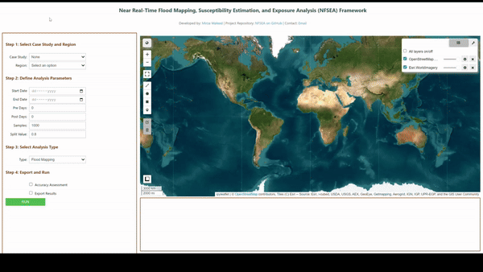

# Near real-time flood mapping, susceptibility estimation and exposure analysis (NFSEA) framework: Leveraging cloud-computing and remote sensing for geo-AI-assisted flood risk management   

**NFSEA Application Working**

## Status

**The paper is currently under review. The data related to this paper will be made available soon.**

## Contact

- [Email](mailto:waleedgeo@outlook.com)

- [LinkedIn](https://www.linkedin.com/in/waleedgeo)

- [Portfolio](https://waleedgeo.com)
